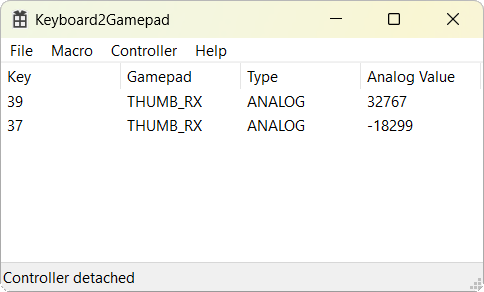

# Keyboard2Gamepad

Win32 program to create keybinds that map to gamepad buttons or specific analog
values when pressed. Uses [ViGEm](https://github.com/ViGEm/ViGEmBus) for the
controller emulation and [mini-yaml](https://github.com/jimmiebergmann/mini-yaml)
for saving/loading the macros.

### Screenshot

## Features

- Keybinds for all Xbox controller buttons, triggers and sticks
- Minimizes the window to tray
- Saves and loads all entered macros

## Requirements

- [ViGEmBus Driver](https://github.com/ViGEm/ViGEmBus) installed
- Latest [Visual C++ Redistributable](https://docs.microsoft.com/en-us/cpp/windows/latest-supported-vc-redist)
(if you get a DLL missing error when starting)
